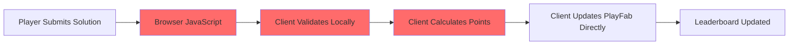
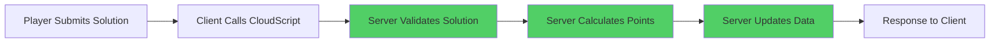

# PlayFab API Analysis & Security Audit

*Date: September 2, 2025*  
*Author: Claude Code Analysis*

## Executive Summary

**Current Architecture Status**: ⚠️ **SECURITY VULNERABILITY IDENTIFIED**

The Mission Control 2045 project has successfully migrated to PlayFab for data storage but has a critical security flaw in task validation. Validation occurs client-side, making scores and leaderboards vulnerable to manipulation.

## PlayFab Integration Status

### ✅ What's Working Correctly

| Component | Status | Implementation |
|-----------|--------|----------------|
| Task Storage | ✅ Complete | 155 tasks in PlayFab Title Data |
| Authentication | ✅ Secure | Anonymous login with CloudScript name generation |
| Progress Tracking | ✅ Functional | User Data API for player progress |
| Leaderboards | ✅ Active | Statistics API with `LevelPoints` |
| Event Logging | ✅ Available | Client events via WritePlayerEvent |

### ❌ Security Vulnerability

| Component | Status | Risk Level | Details |
|-----------|--------|------------|---------|
| Task Validation | ❌ **CLIENT-SIDE** | 🔴 **HIGH** | Solutions validated in browser JavaScript |
| Score Calculation | ❌ **CLIENT-SIDE** | 🔴 **HIGH** | Points, bonuses, penalties calculated in browser |
| Data Updates | ❌ **DIRECT** | 🔴 **HIGH** | Client directly updates User Data and Statistics |

## Available PlayFab APIs

### Admin API Endpoints (Secret Key Access)
*Full administrative control over title configuration*

#### Title Data Management
- `Admin/GetTitleData` - Retrieve all title configuration
- `Admin/SetTitleData` - Update title configuration  
- `Admin/GetTitleInternalData` - Internal title data access
- `Admin/SetTitleInternalData` - Internal title data updates

#### Player Management  
- `Admin/GetUserAccountInfo` - Player account details
- `Admin/GetUserData` - Player custom data access
- `Admin/UpdateUserData` - Player data modifications
- `Admin/BanUsers` - Player moderation capabilities
- `Admin/GetUserBans` - Ban status queries

#### Statistics & Leaderboards
- `Admin/CreatePlayerStatisticDefinition` - Create new statistics
- `Admin/GetPlayerStatisticDefinitions` - Query existing statistics
- `Admin/GetLeaderboard` - Leaderboard data access
- `Admin/UpdatePlayerStatisticDefinition` - Modify statistic settings

#### Virtual Economy
- `Admin/GetCatalogItems` - Catalog management
- `Admin/SetCatalogItems` - Catalog updates
- `Admin/GetStoreItems` - Store configuration
- `Admin/GrantItemsToUsers` - Item distribution

#### CloudScript Management
- `Admin/GetCloudScriptRevision` - Current CloudScript details
- `Admin/UpdateCloudScript` - Deploy new CloudScript functions

### Server API Endpoints (Secret Key Access)
*Server-authoritative operations for secure game logic*

#### Player Operations
- `Server/GetUserData` - Secure player data access
- `Server/UpdateUserData` - Server-side data updates
- `Server/GetPlayerStatistics` - Player statistic queries
- `Server/UpdatePlayerStatistics` - Secure statistic updates

### Client API Endpoints (Public Access)
*Player-facing operations used by React application*

#### Authentication
- `Client/LoginWithCustomID` - Anonymous authentication ✅
- `Client/LoginWithEmailAddress` - Email-based login
- `Client/RegisterPlayFabUser` - New user registration

#### Data Access
- `Client/GetTitleData` - Title configuration access ✅
- `Client/GetUserData` - Player data retrieval ✅
- `Client/UpdateUserData` - Player data updates ⚠️ *Currently used for validation*

#### Statistics
- `Client/UpdatePlayerStatistics` - Statistic updates ⚠️ *Currently used for scores*  
- `Client/GetLeaderboard` - Leaderboard queries ✅

#### CloudScript
- `Client/ExecuteCloudScript` - Execute server functions ✅ *Used for names only*

## Current CloudScript Functions

### Available Functions
1. **`GenerateAnonymousName`** ✅
   - **Purpose**: Atomic username generation  
   - **Usage**: Called by client for new players
   - **Security**: Properly implemented with ETag concurrency control

2. **Standard Examples** (Unused)
   - `helloWorld`, `makeAPICall`, `completedLevel`
   - Photon integration handlers
   - PlayStream event handlers

### Missing Critical Function
❌ **`ValidateTaskSolution`** - Required for secure validation

## Security Architecture Problems

### Current Insecure Flow


**Vulnerabilities:**
- Browser validation can be bypassed with DevTools
- Point calculations can be manipulated
- Fake solutions can be submitted
- Leaderboard integrity compromised

### Required Secure Flow  


**Security Benefits:**
- Server-side validation cannot be bypassed
- Point calculations are authoritative  
- Solution checking occurs in secure environment
- Leaderboard integrity maintained

## Recommended Implementation

### 1. Create CloudScript Validation Function

```javascript
handlers.ValidateTaskSolution = function(args, context) {
    // Get task from Title Data
    const titleData = server.GetTitleData({ Keys: ["tasks.json"] });
    const tasks = JSON.parse(titleData.Data["tasks.json"]);
    const task = tasks.find(t => t.id === args.taskId);
    
    if (!task) {
        return { success: false, error: "Task not found" };
    }
    
    // SERVER-SIDE validation
    const isCorrect = JSON.stringify(args.solution) === JSON.stringify(task.testOutput);
    
    if (!isCorrect) {
        return { success: true, correct: false };
    }
    
    // SERVER-SIDE scoring
    let points = task.basePoints;
    // Apply time bonus, hint penalties...
    
    // SERVER-SIDE data updates
    server.UpdateUserData({...});
    server.UpdatePlayerStatistics({...});
    
    return { success: true, correct: true, points: points };
};
```

### 2. Update Client Integration

Replace client-side `validateSolution()` with:

```typescript
async validateSolution(taskId: string, solution: string[][]): Promise<TaskValidationResult> {
    return new Promise((resolve, reject) => {
        PlayFab.Client.ExecuteCloudScript({
            FunctionName: 'ValidateTaskSolution',
            FunctionParameter: { taskId, solution },
            GeneratePlayStreamEvent: false
        }, (result: any, error: any) => {
            // Handle CloudScript response
        });
    });
}
```

## Migration Impact

### Breaking Changes
- Client validation logic removed
- CloudScript function deployment required
- API call pattern changes

### Benefits
- Leaderboard integrity restored
- Cheat prevention implemented
- Production-ready security
- Matches Unity implementation security model

## Next Steps

1. **Deploy CloudScript Function** - Add `ValidateTaskSolution` to CloudScript
2. **Update Client Code** - Replace direct validation with CloudScript calls  
3. **Test Security** - Verify client cannot bypass server validation
4. **Update Documentation** - Reflect new secure architecture
5. **Version Bump** - Major version due to breaking security changes

---

*This analysis was generated on September 2, 2025, as part of the complete PlayFab migration audit.*