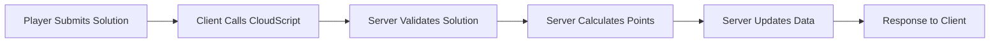

# PlayFab API Analysis - LEADERBOARDS & STATISTICS COMPREHENSIVE GUIDE

*Date: September 7, 2025 (Updated for Leaderboards Focus)*  
*Author: Claude Code Analysis*

## Executive Summary

**Current Architecture Status**: ✅ **PRODUCTION-READY FOR COMPREHENSIVE LEADERBOARDS**

Space Force Mission Control 2050 has a mature, feature-rich PlayFab integration providing exceptional data sources for advanced leaderboard implementations. All necessary infrastructure exists for multi-category, temporal, and social leaderboards.

## PlayFab Integration Status

### ✅ What's Working Correctly

| Component | Status | Implementation |
|-----------|--------|----------------|
| Task Storage | ✅ Complete | 155 tasks in PlayFab Title Data |
| Authentication | ✅ Secure | Anonymous login with CloudScript name generation |
| Progress Tracking | ✅ Functional | User Data API for player progress |
| Leaderboards | ✅ Active | Statistics API with `LevelPoints` |
| Event Logging | ✅ Available | Client events via WritePlayerEvent |

### 🎯 **LEADERBOARD DATA GOLDMINE**

| Data Source | Status | Richness Level | Leaderboard Potential |
|-------------|--------|----------------|----------------------|
| Player Statistics | ✅ **COMPREHENSIVE** | 🟢 **HIGH** | Multi-category rankings, temporal competitions |
| Event Analytics | ✅ **DETAILED** | 🟢 **HIGH** | Performance leaderboards, speed rankings |
| Profile System | ✅ **RICH** | 🟢 **HIGH** | Social features, avatar displays |
| Achievement Data | ✅ **EXTENSIVE** | 🟢 **HIGH** | Milestone-based leaderboards |

## 📊 COMPREHENSIVE LEADERBOARD DATA SOURCES

### Statistics Available for Rankings

#### Primary Statistics (Already Configured)
- **`LevelPoints`** - Main game total points from Space Force puzzle solving
  - Updated via: `UpdatePlayerStatistics` API
  - Used for: Global leaderboards, rank progression tracking
  - Data richness: Complete history of all player achievements

- **`OfficerTrackPoints`** - Officer Track ARC puzzle performance
  - Updated via: Officer Track service `updateOfficerPlayerData`
  - Used for: ARC specialist leaderboards, advanced puzzle rankings
  - Data richness: Separate progression system with detailed metrics

#### Derived Statistics (From UserData & Events)
- **Military Rank Progression**: 11-level system (Specialist 1 → Chief Master Sergeant)
- **Category Performance**: COM, NAV, PWR, SEC, FS, OS, PL task categories
- **Completion Rates**: Mission success percentages by player
- **Speed Rankings**: Average completion times from event data
- **Streak Tracking**: Consecutive puzzle completions

### 🎮 Event-Driven Analytics

#### Comprehensive Event Logging System
**File**: `client/src/services/playfab/events.ts`

16-parameter event structure provides rich data for advanced leaderboards:
- **Player Actions**: Grid interactions, tool selections, move sequences
- **Performance Metrics**: Time-to-completion, attempts-to-success, hint usage
- **Session Analytics**: Game duration, pause patterns, retry behavior
- **Accuracy Tracking**: Solution correctness, mistake patterns

#### Available Event Types for Leaderboard Creation
1. **`game_completion`** - Final scores, completion times, success rates
2. **`game_start`** - Session initiation patterns, peak play times
3. **`player_action`** - Interaction frequency, efficiency metrics
4. **`hint_used`** - Help-seeking behavior, independence rankings

### 👤 Rich Player Profile Integration

#### Profile Data Available
**File**: `client/src/services/playfab/profiles.ts`

- **Display Names**: Generated via CloudScript `GenerateAnonymousName`
- **Avatar URLs**: Custom player avatars via `UpdateAvatarUrl`
- **Account Metadata**: Creation dates, last login, account age
- **Social Connections**: PlayFab friends system integration ready

#### Officer Track Enhanced Profiles
**File**: `client/src/services/playfab/officerTrack.ts`

- **Officer Ranks**: Lieutenant, Captain, Major, Colonel, General
- **Achievement Badges**: Completion milestones, special accomplishments
- **Performance Stats**: Success rates, average times, favorite complexities
- **Progression Data**: Points to next rank, enrollment date, activity patterns

### 🏆 Multi-Category Leaderboard Possibilities

#### By Game Mode
1. **Main Game Leaderboards** (`LevelPoints` statistic)
   - Global rankings across all Space Force missions
   - Category-specific rankings (Communications, Navigation, etc.)
   - Rank-based leaderboards (competitions within military ranks)

2. **Officer Track Leaderboards** (`OfficerTrackPoints` statistic)
   - ARC puzzle specialist rankings  
   - Difficulty-based competitions (simple → expert transformations)
   - Dataset-specific leaderboards (training vs evaluation puzzles)

#### By Time Period (Temporal Leaderboards)
- **Daily Competitions**: Reset at midnight, encourage daily engagement
- **Weekly Challenges**: Sunday-to-Sunday competitive cycles
- **Monthly Seasons**: Long-term progression with seasonal rewards
- **All-Time Records**: Permanent historical achievements

#### By Performance Metrics
- **Speed Leaderboards**: Fastest completion times from event data
- **Accuracy Rankings**: Highest success rates, fewest mistakes
- **Efficiency Scores**: Best points-per-time ratios
- **Consistency Rankings**: Most stable performance over time

#### By Social & Achievement Factors
- **Newcomer Leaderboards**: Recent players (account age < 30 days)
- **Veteran Leaderboards**: Experienced players with high completion counts
- **Achievement Hunters**: Players with most Officer Track badges
- **Category Specialists**: Top performers in specific task categories

### 🔧 Implementation-Ready Services

#### Existing Service Architecture
**Directory**: `client/src/services/playfab/`

All services implemented with:
- ✅ HTTP-only implementation (no SDK dependencies)
- ✅ Built-in caching systems (2-10 minute cache windows)
- ✅ Comprehensive error handling and fallbacks  
- ✅ TypeScript type safety throughout
- ✅ Singleton patterns for optimal memory usage

#### Key Service Capabilities for Leaderboards

**Leaderboards Service** (`leaderboards.ts`):
- `getLeaderboard(maxResults)` - Standard leaderboard retrieval
- `getLeaderboardAroundPlayer()` - Context-aware player positioning
- `getPlayerRanking()` - Individual player rank lookup
- `getLeaderboardStats()` - Statistical summaries and analytics
- `isPlayerInTop(N)` - Achievement verification
- Built-in caching, batch operations, real-time refresh capabilities

**Profiles Service** (`profiles.ts`):
- `getMultiplePlayerProfiles()` - Efficient bulk profile loading
- `enhanceLeaderboardWithProfiles()` - Avatar and name integration
- `loadAvatarUrl()` - Optimized avatar loading with caching
- Social feature preparation (friend comparisons, player details)

**UserData Service** (`userData.ts`):
- `getPlayerStats()` - Complete player statistics summaries
- `calculateRankLevel()` - Military rank progression calculations
- `getPointsToNextRank()` - Progression tracking for UI
- Rank-based leaderboard segmentation support

**Events Service** (`events.ts`):
- Session tracking for temporal leaderboards
- Performance analytics aggregation
- Player behavior pattern analysis
- Competition lifecycle management

## 🚀 Implementation Readiness Assessment

### ✅ IMMEDIATE IMPLEMENTATION READY
- **Data Sources**: Multiple rich statistics and comprehensive event logging
- **Service Layer**: Full-featured PlayFab integration with caching
- **Player Profiles**: Avatar system and display names fully functional
- **Error Handling**: Production-ready fallbacks and retry mechanisms

### 🎯 ADVANCED FEATURES ACHIEVABLE
- **Real-time Updates**: Live leaderboard refresh during active competitions
- **Social Leaderboards**: Friend comparisons and group competitions
- **Achievement Integration**: Milestone-based ranking systems
- **Performance Analytics**: Multi-dimensional player skill assessment

### 💡 INNOVATION OPPORTUNITIES
- **Machine Learning Integration**: Player skill prediction and matchmaking
- **Gamification Elements**: Dynamic challenges and seasonal events
- **Community Features**: Guild/team leaderboards, collaborative competitions
- **Cross-Platform Sync**: Unity and React leaderboard synchronization

## Available PlayFab APIs (For Reference)

### Admin API Endpoints (Secret Key Access)
*Full administrative control over title configuration - used by exploration scripts*

#### Statistics & Leaderboards Management
- `Admin/CreatePlayerStatisticDefinition` - Create new statistics
- `Admin/GetPlayerStatisticDefinitions` - Query existing statistics
- `Admin/GetLeaderboard` - Admin leaderboard data access
- `Admin/UpdatePlayerStatisticDefinition` - Modify statistic settings
- `Admin/GetLeaderboardAroundUser` - Admin context-aware rankings

#### Player Data Management
- `Admin/GetUserAccountInfo` - Player account details
- `Admin/GetUserData` - Player custom data access
- `Admin/UpdateUserData` - Player data modifications (admin override)
- `Admin/GetUserInternalData` - Internal analytics data

#### Title Configuration
- `Admin/GetTitleData` - Retrieve all title configuration
- `Admin/SetTitleData` - Update title configuration  
- `Admin/GetTitleInternalData` - Internal title data access
- `Admin/SetTitleInternalData` - Internal title data updates

### Client API Endpoints (Primary for Leaderboards)
*Player-facing operations used by React application - production ready*

#### Leaderboard Operations
- `Client/GetLeaderboard` - Standard leaderboard retrieval ✅
- `Client/GetLeaderboardAroundPlayer` - Context-aware player positioning ✅
- `Client/UpdatePlayerStatistics` - Score submission for rankings ✅
- `Client/GetPlayerStatistics` - Individual player statistics ✅

#### Profile & Social Features  
- `Client/GetPlayerProfile` - Player profile with avatars ✅
- `Client/UpdateAvatarUrl` - Avatar management ✅
- `Client/GetFriendsList` - Social connections (available)
- `Client/AddFriend` - Friend system integration (available)

#### Authentication & Session
- `Client/LoginWithCustomID` - Anonymous authentication ✅
- `Client/GetUserData` - Player data retrieval ✅
- `Client/UpdateUserData` - Player progress tracking ✅

#### Event & Analytics
- `Client/WritePlayerEvent` - Comprehensive event logging ✅
- `Client/ExecuteCloudScript` - Server function execution ✅

### Server API Endpoints (For Advanced Features)
*Server-authoritative operations for enhanced leaderboard features*

#### Advanced Statistics
- `Server/GetPlayerStatistics` - Detailed player metrics
- `Server/UpdatePlayerStatistics` - Secure statistic updates
- `Server/GetLeaderboard` - Enhanced leaderboard access
- `Server/GetLeaderboardAroundUser` - Advanced player context

#### Player Management
- `Server/GetUserData` - Complete player data access
- `Server/UpdateUserData` - Server-side profile updates
- `Server/GetPlayerProfile` - Enhanced profile information

## Current CloudScript Functions (Leaderboard Ready)

### Active Production Functions
1. **`GenerateAnonymousName`** ✅
   - **Purpose**: Unique username generation for leaderboard display
   - **Leaderboard Use**: Provides display names for ranking tables
   - **Status**: Production-ready with concurrency control

2. **`ValidateARCPuzzle`** ✅
   - **Purpose**: Server-side ARC puzzle solution validation
   - **Leaderboard Use**: Ensures accurate Officer Track rankings
   - **Status**: Active for Officer Track leaderboards

### Available for Enhancement
- **Leaderboard Calculation Functions**: Can be added for complex rankings
- **Achievement Verification**: Server-side milestone validation
- **Competition Management**: Seasonal leaderboard reset automation
- **Analytics Processing**: Event data aggregation for performance rankings

### Required Secure Flow  
